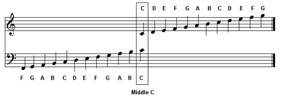

## Objective
- explore occurence of chord progression in modern music   


[](http://www.youtube.com/watch?v=oOlDewpCfZQ)   

***

## A little bit of Music Theory

### We all know about notes:  

   

***   

### A group of notes can form a chord  

   

***  

### Chord progression:  

  * Is the sequencing of chords to form harmony  

  * This is a G-Em-C-D chord progression:   
  
<audio controls="1">
  <source src="http://www.guitarator.com/wp-content/audio/Eddy%20Boston%20-%20I-vi-IV-V%20Key%20of%20G.mp3"
          data-external="1" type="audio/mpeg">
  </source>
</audio>


  * this is another chord progression C-Am-F-G     
  
<audio controls="1">
  <source src="http://www.guitarator.com/wp-content/audio/Eddy%20Boston%20-%20I-vi-IV-V%20Key%20of%20C.mp3"
          data-external="1" type="audio/mpeg">
  </source>
</audio>   

***   


### Roman numeral notation:  

  * This brings us to the Roman numeral notation which simplifies the representation of all chord progression     
  * The previous two examples of chord progression are actually similar.  
  * They are the same chord progression except they were played in a different key.  
  
   

  * Our examples were the __I-vi-IV-V__, the first was in the key of __G__, second was in key of __C__

***

## What chord progressions are used in modern music?  

Website scraped  

* www.hooktheory.com  
    + Lists song and artist and the chord progression used in the song.
    + Only a limited number of songs but is so far the biggest collection of songs analyzed. 

* Spotify API
    + Popularity - Spotify's rating based on how often a song is played by spotify users.  
    + Valence - the overall mood of a song. Happy -> 1. Dark -> 0.  
    + Release date  


***

```{r setup, include=FALSE}
knitr::opts_chunk$set(echo = FALSE, warning = FALSE)
```

```{r library, include=FALSE}
library(readr)
library(ggplot2)
library(dplyr)
library(tidyr)
library(RColorBrewer)
```


```{r load data, include=FALSE}
df <- read_csv("forEDA_moredeets.csv")
#dropping index remnants from python
df <- df[,c(-1,-2)]
#creating year column
df$release_year <- substr(df$release_date, 1,4)
#splitting chord progressions
df <- df %>% separate(cprog, into = paste("C", 1:4, sep = "_"), remove = FALSE)
#removing 6.4.1.5, 4.2.6.3
df <- df %>% filter(cprog != c("6.4.1.5", "4.2.6.3"))

#adding spaces to 2nd, 3rd, and 4th col
#to workaround sankey callback error
df$C_2 <- paste(df$C_2," ",sep="")
df$C_3 <- paste(df$C_3,"  ",sep="")
df$C_4 <- paste(df$C_4,"   ",sep="")
```

## About our dataset

* __1,959 songs__   
    * across __17 chord progression__ categories.   
* 164 songs not in Spotify's database.   
    * no valence, popularity, and release date information.   

```{r investigating df}
#str(df)
summary(df)
#sum(!complete.cases(df))
#min(df$release_year, na.rm = T)
#max(df$release_year, na.rm = T)
#sapply(df[ ,c(11,8,13,14)], sd, na.rm=TRUE)
```


```{r Bar chart count per cprog, echo=FALSE}

colourCount = length(unique(df$cprog))
getPalette = colorRampPalette(brewer.pal(9, "Set1"))

bc <- ggplot(df, aes(x=cprog, fill = cprog)) + 
    geom_bar() + 
    scale_fill_manual(values = getPalette(colourCount)) +
    labs(title = "Song Occurence per Chord Progression", x = "Chord Progression", y = "Count") +
    theme(axis.text.x=element_text(angle=45, hjust=1)) 
bc
```


* __1.5.6.4 has highest occurence.__   
    + This validates the claim that this is the most commonly occuring chord progression.   
* 1.5.4.1 has significant occurence over the other "named progressions" such as:   
    + Pachelbel prog, 1.5.6.3, and   
    + the 50's chord prog, 1.6.4.5.   
* 6.5.4.5 also prominent in occurence    

**Thanks to spotify, more analysis can be done.**     

* What chord progression is __trending__ over the years?    
    + Will we see others rising/falling in occurence over the years?    
    
* Is there a __relationship__ between __chord progression__ and the following:    
    + __Popularity__    
    + __Valence or Mood__    
    
***  


```{r Bar chart count per cprog per year, echo=FALSE}
df.y <- df %>% filter(!is.na(release_year))

bcy <- ggplot(data = df.y, aes(x = release_year, fill = cprog)) + geom_bar()
bcy <- bcy + scale_fill_manual(values = getPalette(colourCount)) 

bcy + facet_grid(cprog ~ ., scales = "free") +
  theme(axis.text.x=element_text(angle=45, hjust=1)) +
  labs(title = "Song Occurence per Chord Progression through the Years", x = "Year", y = "Count")
```

The dataset does not have a good enough sample of old songs.  

***  

```{r box plot popularity, warning=FALSE}
df$cprog <- as.factor(df$cprog)
df.no0 <- df %>% filter(popularity != 0)

means.p <- aggregate(popularity ~  cprog, df.no0, mean)
means.p$popularity <- round(means.p$popularity, digits = 1)
bp <- ggplot(df.no0, aes(cprog,popularity, fill=cprog)) + geom_boxplot()
bp + scale_fill_manual(values = getPalette(colourCount)) +
  theme(axis.text.x=element_text(angle=45, hjust=1)) +
  labs(title = "Popularity per Chord Progression", x = "Chord Progression", y = "Popularity") + stat_summary(fun.y=mean, colour="darkred", geom="point", 
               shape=18, size=3,show.legend = FALSE) + 
  geom_text(data = means.p, aes(label = popularity, y = popularity + 0.02))
```

__4.5.6.2__ seems to have the highest median popularity among the group.  
__1.4.6.5__ seems to have the highest mean popularity among the group.  


```{r box plot energy, eval=FALSE, warning=FALSE, include=FALSE}
means.e <- aggregate(energy ~  cprog, df, mean)
means.e$energy <- round(means.e$energy, digits = 2)
bp <- ggplot(df, aes(cprog,energy, fill=cprog)) + geom_boxplot()
bp + scale_fill_manual(values = getPalette(colourCount)) +
  theme(axis.text.x=element_text(angle=45, hjust=1)) +
  labs(title = "Energy per Chord Progression", x = "Chord Progression", y = "Energy") + stat_summary(fun.y=mean, colour="darkred", geom="point", 
               shape=18, size=3,show.legend = FALSE) + 
  geom_text(data = means.e, aes(label = energy, y = energy + 0.02))

#Energy seems to be independent of the chord progression overall.

```

***  


```{r box plot tempo, eval=FALSE, warning=FALSE, include=FALSE}
means.t <- aggregate(tempo ~  cprog, df, mean)
means.t$tempo <- round(means.t$tempo, digits = 1)
bp <- ggplot(df, aes(cprog,tempo, fill=cprog)) + geom_boxplot()
bp + scale_fill_manual(values = getPalette(colourCount)) +
  theme(axis.text.x=element_text(angle=45, hjust=1)) +
  labs(title = "Tempo per Chord Progression", x = "Chord Progression", y = "Tempo") + stat_summary(fun.y=mean, colour="darkred", geom="point", 
               shape=18, size=3,show.legend = FALSE) + 
  geom_text(data = means.t, aes(label = tempo, y = tempo + 0.02))

#Visually, no pattern can be discerned from plotting tempo against chord progression

```


```{r box plot valence, warning=FALSE}
means.v <- aggregate(valence ~  cprog, df, mean)
means.v$valence <- round(means.v$valence, digits = 2)
bv <- ggplot(df, aes(cprog,valence, fill=cprog)) + geom_boxplot()
bv + scale_fill_manual(values = getPalette(colourCount)) +
  theme(axis.text.x=element_text(angle=45, hjust=1)) +
  labs(title = "Boxplot of Valence per Chord Progression", x = "Chord Progression", y = "Valence") + stat_summary(fun.y=mean, colour="darkred", geom="point", 
               shape=18, size=3,show.legend = FALSE) + 
  geom_text(data = means.v, aes(label = valence, y = valence + 0.02))

```

There seems to be a __low valence trend__ for chord progressions starting with __6/vi__, which is a minor chord. 

Investigating further by checking the density distribution of the valence for each chord progression.  

***  

```{r Valence density per cprog, warning=FALSE}
a <- ggplot(df, aes(x = valence, fill = cprog)) + geom_density()
a + scale_fill_manual(values = getPalette(colourCount)) + facet_grid(cprog ~ .) +
  theme(axis.text.x=element_text(angle=45, hjust=1)) +
  labs(title = "Valence per Chord Progression", x = "Valence", y = "Density")

```

Is there a significant difference in popularity and valence based on the chord progression?   

***   

We can do one-way __ANOVA__ to see.  
Do a variance test first!  


__H0__ = there is statistically __no difference in the variances__ of popularity and valence for all cprog.  
__Ha__ = there __is a difference__ in the variance.

If H0 = TRUE, we can proceed with Hypothesis testing   

### Variance Test   

```{r variance test cprog}
bartlett.test(popularity~cprog, df)
bartlett.test(valence~cprog, df)

```
__p-value popularity = 0.6156__  
__p-value valence = 0.4387__

H0 cannot be rejected and is therefore TRUE.   
We can proceed with ANOVA.   

__H0__ = there is statistically __no difference in the means__ of popularity and valence for all cprog.  
__Ha__ = there __is a difference__ in the means.


### ANOVA Test   

```{r anova cprog}
res_pop <- aov(popularity~cprog, df)
summary(res_pop)

res_val <- aov(valence~cprog, df)
summary(res_val)

```

For both tests, __p-value is less than 0.05__, which means that there is a significant difference in the means of both popularity and valence in our dataset.


But which chord progressions induced the differences in popularity and valence?

A post-hoc Tukey test will be performed to see which combinations showed the significant difference in the means of popularity and valence.

However, a Tukey test will compare __all possible pair combination__, which will be n*(n-1)/2 or for this case = __136 pairs__. 

```{r post hoc cprog}
TukeyHSD(res_val, which="cprog")

TukeyHSD(res_pop, which="cprog")

```

Am I cursed with high dimensionality?  
Should I reduce my categories?  
How do I reduce categories?    

***   

A quick look at the Tukey test results might lead to a way to minimize the categories.
Significant difference were seen if we consider the start chord only.   

***   

To reduce the categories, I regrouped the songs based on the starting note of their chord progression.  
I now have __3 groups__, songs that start with    

* I  
* IV 
* vi

***   

### Variance Test, again

```{r variance test C_1}
bartlett.test(popularity~C_1, df)

bartlett.test(valence~C_1, df)

```
__p-value popularity = 0.05982__
__p-value valence = 0.4314__

H0 cannot be rejected, therefore TRUE. SD do not differ significantly which means we can test    

***    


### ANOVA Test, again

```{r anova C_1}
res_popC1 <- aov(popularity~C_1, df)
summary(res_popC1)

res_valC1 <- aov(valence~C_1, df)
summary(res_valC1)
```

p-values for both poularity and valence test were __less than 0.05__ which means there is a difference in the means. Performing the Tukey test will show us where the difference lies.   

***   

## Tukey Test  

```{r post hoc}
TukeyHSD(res_popC1, which="C_1")

TukeyHSD(res_valC1, which="C_1")

```

The results indicate that the __mean popularity differs with the starting chord__,   

* IV is less popular than I   

and also the __mean valence__ differs when the chord progression __starts on a Major chord(I) or a minor chord(vi)__.   

* vi have lower valence score than I.  


<!-- ***    -->


<!-- Will a "minor song" tend to be more popular? Will a  -->
<!-- "Major song" tend to be sadder sounding?   -->

<!-- ***    -->

<!-- ```{r lm C_1} -->
<!-- mmpC1 <- lm(popularity ~ C_1, data = df)  -->
<!-- summary(mmpC1) -->
<!-- mmvC1 <- lm(valence ~ C_1, data = df) -->
<!-- summary(mmvC1) -->

<!-- ``` -->

*** 

## Interpretation  

The I, IV, are all major chords. The vi is minor or as some refer to The Relative Minor or “Shadowy Twin”.      

Musicians use the major and minor chords like a pallete.  

Roughly speaking, major chords have a happier, more open sound, whereas minor chords are darker and more claustrophobic.   

